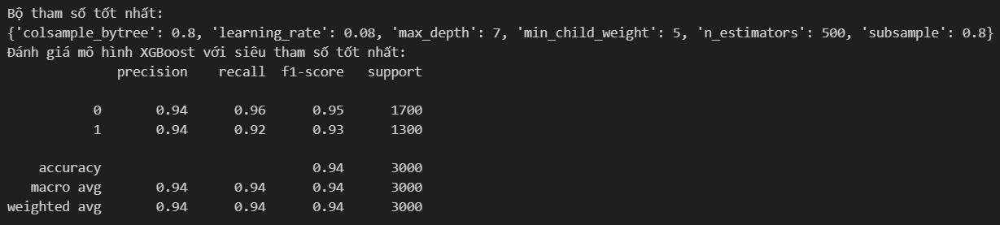

# Airline Passenger Satisfaction Prediction ✈️

## 📌 Tổng quan dự án (Overview)
Dự án tập trung vào việc xây dựng mô hình học máy để dự báo hành khách sẽ "Hài lòng" hay "Không hài lòng" dựa trên các điểm chạm (touchpoints) dịch vụ. Từ đó, đề xuất giải pháp cải thiện các dịch vụ then chốt nhằm tối ưu hóa trải nghiệm khách hàng.

---

## 🏗️ Cấu trúc dự án theo mô hình S.T.A.R

### 1. Situation (Bối cảnh)
* **Bối cảnh:** Ngành hàng không cạnh tranh gay gắt, việc giữ chân khách hàng thông qua dịch vụ là ưu tiên hàng đầu.
* **Vấn đề:** Doanh nghiệp cần xác định chính xác dịch vụ nào đang gây thất vọng nhất để ưu tiên nguồn lực sửa chữa.

### 2. Task (Nhiệm vụ)
* **Mô hình:** Xây dựng và so sánh các thuật toán phân loại (Classification) để tìm ra mô hình dự báo chính xác nhất.
* **Insights:** Phân tích mức độ quan trọng của các tính năng (Feature Importance) để tìm ra "chìa khóa" của sự hài lòng.

### 3. Action (Hành động)
* **EDA & Preprocessing:** - Xử lý giá trị thiếu (Imputation) cho cột `Arrival Delay`.
    - Mã hóa các biến danh mục (Gender, Customer Type, Type of Travel...).
* **Modeling:** Triển khai đồng thời nhiều thuật toán: Logistic Regression, Decision Tree, Random Forest, XGBoost.
* **Evaluation:** Đánh giá mô hình dựa trên Accuracy, Precision, Recall và F1-Score. 
* **Deployment:** Xây dựng giao diện Demo bằng **Gradio** để dự báo trực tiếp từ file CSV.

### 4. Result (Kết quả)
* **Mô hình tối ưu:** XGBoost Classifier đạt độ chính xác 0.94%.

* **Phát hiện quan trọng:** Xác định được các yếu tố như `Inflight entertainment`, `Inflight wifi service` và `Online booking` là những yếu tố ảnh hưởng mạnh nhất đến sự hài lòng.
* **Ứng dụng:** File demo giúp bộ phận CSKH có thể tải lên danh sách hành khách sau chuyến bay để lọc ra ngay những khách hàng cần chăm sóc đặc biệt.

---

## 🛠️ Công nghệ sử dụng (Tech Stack)
* **Ngôn ngữ:** Python.
* **Thư viện:** Pandas, Scikit-learn, Seaborn, Matplotlib, Numpy, Math, xgboost.
* **Deployment:** Gradio (Giao diện dự báo trực tuyến).

---

## 👉 [https://drive.google.com/drive/folders/1Nnm9n1Et5_0Dr8IGnNkHDq5eAchVcGxz?usp=sharing]